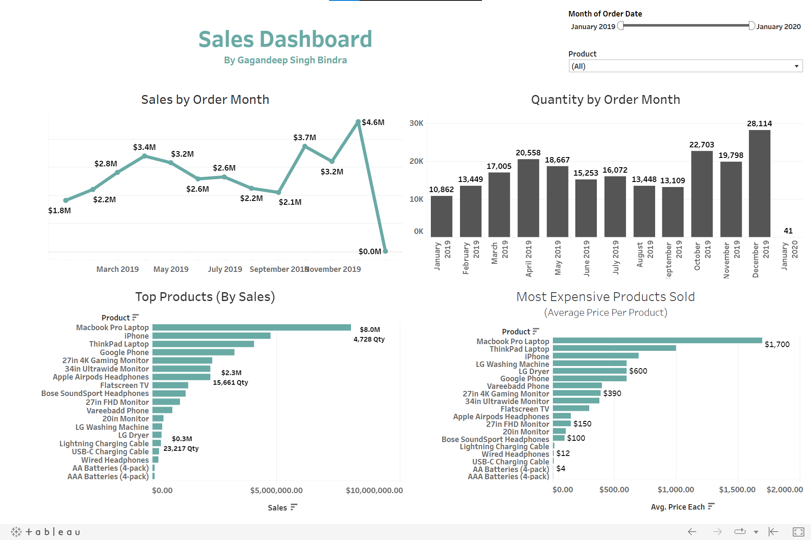

# Sales Dashboard
[Dashboard can be viewed here.](https://public.tableau.com/views/SalesDashboard_16620526311780/Dashboard1?:language=en-US&publish=yes&:display_count=n&:origin=viz_share_link) 

### Overview
Suppose you are a manager of a store or an e-commerce brand like amazon, Walmart, etc. and you wish to require an update of your store's top selling products and sales by month for conducting your business decisions. 
Using a Sales Dashboard such as this one we can solve this problem. This Dashboard gives you all the required the information in one place and by tweaking products and timeline one can get even more detailed information.

Insights generated:
1.  The sales show a positive trend which indicates good business foundations.
2. Sales are highest at the end of the year which suggests that the business must keep its stock during the months of October through December full to expect a good revenue.
3. Since Sales drop sharply at January 2019 there is reason to believe that the customers of this business find it most convenient to shop here during the winter holidays (Christmas, New years).

## Dashboard

